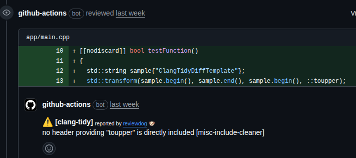
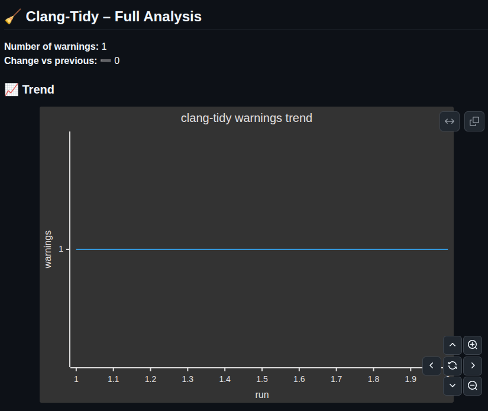
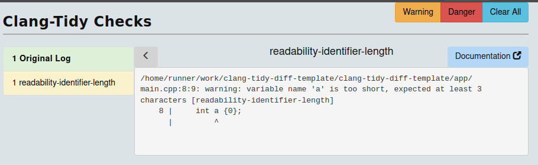

# CMake + clang-tidy Project Template (with GitHub Actions)

This repository is a minimal C++/CMake template that includes ready-to-use GitHub Actions to run clang-tidy.

There are three workflows provided; in practice two of the three are used by default.

## Available workflows

- `clang-tidy-diff-reviewdog` (recommended — runs on PR)
  - **Trigger**: pull_request.
  - **Steps**: checkout, install [cmake, clang-tidy], generate compile_commands.json, install reviewdog, locate clang-tidy-diff.py, run git diff piped to clang-tidy-diff.py and forward results to reviewdog.
  - **Behavior**: runs clang-tidy only on changed lines/contexts using clang-tidy-diff.py and posts inline PR comments via reviewdog.
  - **NOTE**: You may need to replace the `clang-tidy-diff.py` search step with `TIDY_DIFF=$(find /usr -type f -path "*/share/clang/clang-tidy-diff.py" 2>/dev/null | head -n 1)`. This version should also support older compiler versions, but takes more time, so I haven't used it in my repo.

- `clang-tidy-changed-files-reviewdog` (optional, for PRs)
  - **Trigger**: pull_request (file delivered but this action is disabled).
  - **Steps**: checkout, install [cmake, clang-tidy], generate compile_commands.json, gather changed source/header files with git diff --name-only, run clang-tidy on those files and pipe output to reviewdog.
  - **Behavior**: produces reviewdog PR comments for issues in the changed files (useful if you prefer full-file checks rather than only diff lines).

- `clang-tidy-full` (full-project scan, scheduled or manual)
  - **Trigger**: a monthly schedule.
  - **Steps**: checkout, install [cmake, clang-tidy, clang-html], generate compile_commands.json, collect all source files, run clang-tidy over the whole codebase, save full output, count warnings, update a trend CSV, generate a Mermaid trend snippet and create an HTML report with clang-tidy-html, upload artifacts and write a job summary.
  - **Behavior**: produces a full interactive HTML report (artifact) and keeps a simple trend of warning counts across runs.

## Compilation database required by clang-tidy
- All workflows in this repository call CMake with -DCMAKE_EXPORT_COMPILE_COMMANDS=ON to produce the compilation database, which clang-tidy requires to work properly.

## How to enable/disable workflows
- Recommended workflows: enable `clang-tidy-diff-reviewdog` (PR-based, recommends inline review via reviewdog) and `clang-tidy-full` (full monthly/manual scan).
- Workflow files live in .github/workflows/ — you can edit, rename or remove the YAML files to change activation, or manage workflow activation and runs via the "Actions" tab on the repository page in GitHub.

## Workflow output examples
- Example of PR comment produced by clang-tidy-diff-reviewdog:

- Example of Mermaid trend chart in the full scan:

- Example of HTML report generated by clang-tidy-html:

## Makefile — run clang-tidy-diff locally
This repository includes a `Makefile` with several useful targets (e.g. `configure`, `build-app`, `run-clang-tidy`) that let you run clang-tidy locally limited to the changed lines on the current branch.

Quick usage:
- `make configure`        # generates build/ with compile_commands.json
- `make build-app`        # builds the project (optional)
- `make run-clang-tidy`   # runs clang-tidy-diff.py against origin/{MAIN_BRANCH} and reports only changed lines

Notes:
- `run-clang-tidy` searches for the clang-tidy-diff.py script on the system (e.g. /usr/.../share/clang/clang-tidy-diff.py) and compares the current branch with origin/{MAIN_BRANCH}.
- Requirements: clang-tidy and clang-tidy-diff.py available on the system and a valid compile_commands.json in build/.
- Useful to locally check only the changes on your branch before opening a PR.

## Tools used in CI
- clang-tidy + clang-tidy-diff.py (LLVM)
- reviewdog (for PR comments/annotations)
- clang-tidy-html (for HTML reports)
